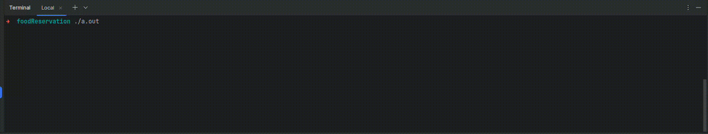

# Food Reservation

It's an app for controlling reservation canteen of organisations
for both admin(staff) and student(in my case the organisation is a school).
It contains some other non-related to food feature like news, poll, etc.

The app contain some bugs and not-finished parts, hopefully I will fix them in the future.

I only test this project on ubuntu, and I'm not sure that it would work on other os.
## Installation
for ubuntu users:

first you need to download and install postqresql.
(I used this website it worked fine)
https://www.digitalocean.com/community/tutorials/how-to-install-postgresql-on-ubuntu-20-04-quickstart

creat a database named foodReservation with user:postgres, password:pashmakid
on local host

then you need a library to connect to database

    sudo apt-get install libpq-dev

(in my case to access the library i should include <postgresql/libpq-fe.h>)

i used curses.h for controling console(the following commend will install it)

    sudo apt-get install libncurses5-dev libncursesw5-dev  

## Demo

